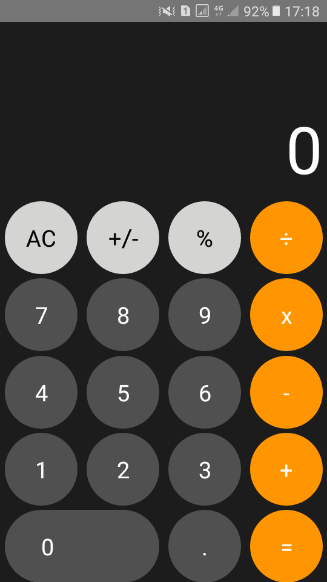

<h1 align="center">Embreo Task</h1>

  
  </a>

# Table of Contents

- [Table of Contents](#table-of-contents)
- [Introduction](#introduction)
- [Functional programming](#functional-programming)
  - [Requirements](#requirements)
  - [How To Start](#how-to-start)
- [Ios Calculator](#ios-calculator)
  - [Requirements](#requirements-1)
  - [How To Start](#how-to-start-1)
  - [Plugins](#plugins)
  - [Download Apk](#download-apk)
  - [Screenshot](#screenshot)
  - [Demo App (Youtube)](#demo-app-youtube)
- [Contributor](#contributor)

# Introduction

Embreo task (functional programming and build ios calculator using react native)

# Functional programming

## Requirements

- node.js
- code editor (visual studio code recommend)

## How To Start

    $ git clone https://github.com/tejojr/embreo-task.git
    $ cd embreo-task && cd task 2 && cd functional_programming
    To run :
    $ node fileName

# Ios Calculator

## Requirements

- Ready to run react native
- code editor (visual studio code recommend)

## How To Start

    - > Enter Project
    $ cd embreo-task && cd task 2 && cd embreocalc
    - > Install Dependecy
    $ npm i
    -> Run Project
        <-> Android
         $ npm run android
        <-> Ios
        $ npm run ios

note : appvalidateSigningDebug failed-> https://stackoverflow.com/questions/57104357/react-native-task-appvalidatesigningdebug-failed

## Plugins

| Plugin       | Version |
| ------------ | ------- |
| react-native | 0.61.4  |
| numeral      | ^2.0.6  |
| mathjs       | ^3.18.0 |

- Linter
  - > Eslint -> arbnb (coding style)

## Download Apk

Download the APK [`here`](https://github.com/tejojr/embreo-task/blob/master/task2/docs/app-release.apk)

## Screenshot

    
    
    

## Demo App (Youtube)

Demo the APK [`here`](https://www.youtube.com/watch?v=cHOGFXnTkZcA)

# Contributor

<a href="https://github.com/tejojr">
          
           
          
          <b>Ammar Annajih Pasifiky
          </b>
          
</a>
